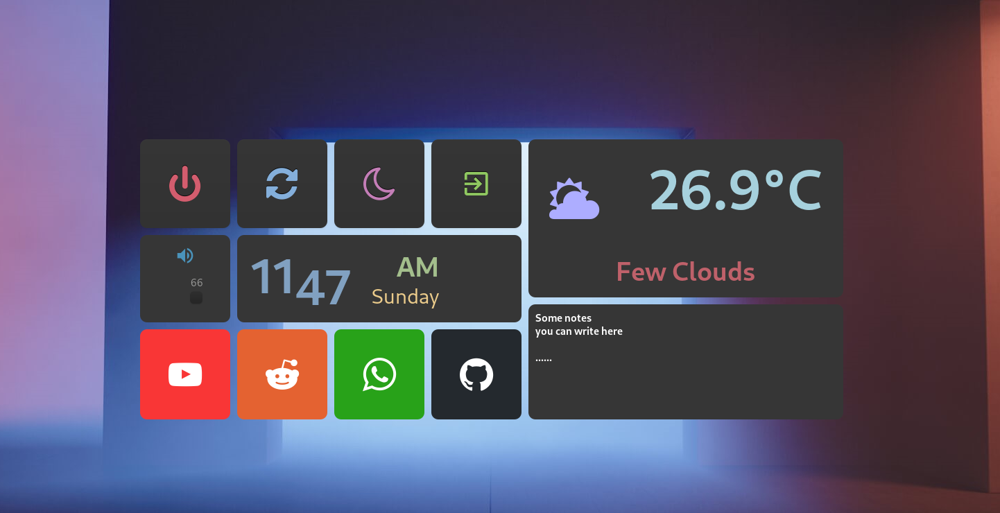

# A guide to my personal setup

This guide contains everything I do to completely setup my distro.

# Dashboard



# Installation

## Install Arch Linux

Download the Arch Linux ISO from the official website.
Burn the ISO file to a USB medium.
```bash
sudo dd bs=4M if=/path/to/iso of=/dev/usb conv=fdatasync
```
Live CD into the USB and run `archinstall` (or, do it the [hard way](https://wiki.archlinux.org/title/installation_guide)).
Proceed with the installation.
No desktop enviroment is needed.

## Wi-FI
If you need to connect to a Wi-Fi network you can use `iwctl`.
```bash
systemctl enable iwd
systemctl start iwd
iwctl
<connect>
```

## Git

### Basic configuration
```bash
sudo pacman -S git
git config --global user.name <user>
git config --global user.email <email>
```

### GPG Keys

```bash
# Create the key pair
gpg2 --expert --full-gen-key
# or import them
gpg2 --import public.gpg
gpg2 --import private.gpg
```

Get the uid of the key using
```bash
gpg2 --list-secret-keys
```

If you created the key pair, export the public key
```bash
gpg2 --export --armor --output public.gpg <KEY>
```

Import the key to your profile
at [https://github.com/settings/keys](https://github.com/settings/keys)
and set up git
```bash
rm public.gpg
git config --global --unset gpg.program
git config --global --add gpg.program /usr/bin/gpg2
git config --global user.signingkey <KEY>
git config --global commit.gpgsign true 
```

## Rust
```bash
sudo pacman -S cargo rustup
rustup default stable
```


## Installing Paru (AUR helper)
```bash
sudo pacman -S --needed base-devel
git clone https://aur.archlinux.org/paru.git
cd paru
makepkg -si
cd ..
rm -r paru
```

## Chaotic-Aur
Follow the instructions at [https://aur.chaotic.cx/](https://aur.chaotic.cx/)

## Download the dotfiles
Download the dotfiles from this repository.
```bash
git clone https://github.com/paolobettelini/dotfiles
```

## Common packages
```bash
sudo pacman -S
    pipewire
    wireplumber
    piper # gaming mouse configuration
    firefox # browser
    nautilus # file explorer
    gwenview # image viewer
    alacritty # terminal
    exa # alternative to "ls"
    swayimg # Image viewer with overlay
    celluloid # Video player
    dunst # notifications
    cmatrix
    nmap
    dysk # disk info
    ripgrep
    ntfs-3g # mount ntfs partitions (driver)
    alsa-utils # audio system
    jq # json parser
    grim # screenshots
    slurp # select a region of the compositor
paru -S
    gotop # system monitoring
    pacseek # navigate through aur
```

## xdg-desktop-portal
```bash
sudo pacman -S xdg-desktop-portal
    xdg-desktop-portal-gtk # backend 1
    xdg-desktop-portal-hyprland # backend 2
```

## Discord
```bash
pacman -S discord-canary # discord with updated electron
```

### OpenAsar
[OpenAsar](https://openasar.dev/) is a plugin for discord
```bash
paru -S openasar-git
```

Using `OpenAsar` you can choose a theme
from [here](https://betterdiscord.app/themes) and upload it in the settings.

The live streaming will work with `xwaylandvideobridge` (see below).
<br>
This cannot share audio, if you need to the program `discord-screenaudio` is a discord
version that lets you stream with audio on Wayland.
```bash
paru -S discord-screenaudio
```

## Scripts
Personal scripts

```bash
cd dotfiles
sudo chmod +x scripts/*
sudo cp scripts/* /usr/local/bin
cd ..
```

## Hyprland
```bash
paru -S hyprland-git
```
Copy the dotfiles
```bash
cd dotfiles
mkdir -p ~/.config/hypr
cp -r hyprland/* ~/.config/hypr/
cd ..
```

## Rtfetch
```bash
git clone https://github.com/paolobettelini/rtfetch
cd rtfetch
rustup default nightly
cargo build --release
sudo mv target/release/rtfetch /usr/local/bin
```


## Fish (shell)
```bash
sudo pacman -S fish starship
cd dotfiles

mkdir -p ~/.config/starship
mkdir -p ~/.config/fish

fish
exit

cat fish/config.fish >> ~/.config/fish/config.fish
cp starship/starship.toml ~/.config/starship/
```
You can now set fish as the default shell
```bash
chsh -s /bin/fish
```

## Application launcher
```bash
sudo pacman -S rofi
mkdir -p ~/.config/rofi
cd dotfiles
cp rofi/config.rasi ~/.config/rofi/
cd ..
```
To start it run `rofi -show drun`.

## Wallpapers (animated or static)
Create a folder for your wallpapers
```bash
sudo mkdir -p /usr/share/backgrounds

cd dotfiles
sudo cp wallpapers/* /usr/share/backgrounds/
cd ..
```
Install `swww`
<!--  TODO use paru ?-->

```bash
git clone https://github.com/Horus645/swww
cd swww
cargo build --release
sudo mv target/release/swww /usr/local/bin/
sudo mv target/release/swww-daemon /usr/local/bin/
```
To set the background run
`swww img /path/to/wallpaper`.

## Neovim
TODO
```bash
sudo pacman -S neovim
mkdir ~/.config/nvim
cd ~/.config/nvim

git clone --depth 1 https://github.com/wbthomason/packer.nvim\
 ~/.local/share/nvim/site/pack/packer/start/packer.nvim
```

## NvChad

## Screen recording
```bash
pacman -S wf-recorder
```

## SDDM (Display manager)
```bash
paru -S sddm-git
sudo systemctl enable sddm

sudo mkdir -p /etc/sddm.conf.d
cd dotfiles
sudo cp sddm/sddm.conf /etc/sddm.conf.d/
```
Download the theme from [here](https://www.opendesktop.org/p/1312658)
```bash
sudo mkdir -p /usr/share/sddm/themes/*
sudo rm -r /usr/share/sddm/themes/*
sudo tar -xzvf ~/Downloads/sugar-candy.tar.gz -C /usr/share/sddm/themes
sudo cp sddm/theme.conf.user /usr/share/sddm/themes/sugar-candy
cd ..
```

## Clipboard manager
```bash
sudo pacman -S cliphist
```
<!-- exec-once + hotkey -->

## Screen sharing
See https://wiki.hyprland.org/Useful-Utilities/Screen-Sharing/
(might easily change)
```bash
paru -S xwaylandvideobridge-cursor-mode-2-git
```
<!-- windowrules + exec-once -->

## Theming

### Icons
```bash
sudo pacman -S hicolor-icon-theme # fallback icons
sudo pacman -S adwaita-icon-theme
```
Download the `Candy Icons` icons
from [here](https://github.com/EliverLara/candy-icons/archive/refs/heads/master.zip)
```bash
unzip candy-icons-master.zip
sudo mv candy-icons-master /usr/share/icons/candy-icons
```
TODO Sweet folders from [here](https://github.com/EliverLara/Sweet-folders)

### Fonts
Download your font from
[here](https://www.nerdfonts.com/font-downloads)
(FantasqueSansMono Nerd Font)
(DejaVuSansMono Nerd Font)
```bash
sudo mkdir -p /usr/local/share/fonts
sudo unzip -a ~/Downloads/DejaVuSansMono.zip -d /usr/local/share/fonts/
/usr/local/share/fonts/
sudo rm /usr/local/share/fonts/*.txt
sudo rm /usr/local/share/fonts/*.md
```

TODO NotoColorEmoji.ttf

### QT Theme
```bash
# 
```

### GTK Theme
Download the source code from [here](https://github.com/EliverLara/Sweet/tree/nova)
(branch:`nova`)
```bash
unzip Sweet-nova.zip
sudo mv Sweet-nova /usr/share/themes/Sweet-Nova
sudo chown -R root:root /usr/share/themes/Sweet-Nova
```

### Apply theming
```bash
paru -S nwg-look-bin
# nwg-look handles GTK2 and GTK3
nwg-look # select theme and icons
qt5ct # select theme and icons
qt6ct # select theme and icons
# for GTK4
```
The theme is also set in `hyprland.conf` at `env = GTK_THEME,Sweet-Dark-v40`.

## Plugins

### Prepare enviroment
```bash
sudo pacman -S cpio # needed by pluginenv
paru -S libdisplay-info # I don't know if you need this

git clone --recursive https://github.com/hyprwm/Hyprland
cd Hyprland
git reset --hard (hyprctl version | grep "commit" | awk '{print $8}' | sed 's/dirty$//')
sudo make pluginenv
export HYPRLAND_HEADERS=(pwd)
cd ..
mkdir /usr/share/plugins # Place for your plugins (.so files)
```

### Install plugin(s)
```bash
git clone https://github.com/paolobettelini/split-monitor-workspaces
cd split-monitor-workspaces
make all
sudo mv split-monitor-workspaces.so /usr/share/plugins/
```
The plugin is initialized in the `hyprland` config.

## Widgets
```bash
cd dotfiles/widgets/dashboard
cargo b --release
sudo mv target/release/dashboard /usr/local/bin/
cd ../..
```
TODO Api key, city ...

TODO install qt5-wayland or qt6-wayland 

## MPD
```bash
sudo pacman -S mpc mpd
mkdir -p ~/.config/mpd
mkdir -p ~/.mpd
cd dotfiles
cp mpd/mpd.conf ~/.config/mpd/mpd.conf
cd ..
systemctl --user enable mpd.service
```
TODO

## LaTeX
```bash
sudo pacman -S tectonic
```

# Latex-Rec
```bash
git clone https://github.com/paolobettelini/tauri-myscript-latex
cd tauri-myscript-latex
cargo tauri build
sudo mv src-tauri/target/release/bundle/appimage/latex-rec_<v>.AppImage /usr/local/bin/latex-rec
cd ..
```

<!--
TODO:
make code and firefox "fakefullscreen" when spawned
make non floating window drabble without centering
them around the cursor

Prnters
sudo pacman -S cups cups-pdf
sudo systemctl enable cups.service
sudo systemctl start cups.service

fish -> exa
hyprland -> swww
fish -> rtfetch
-->
