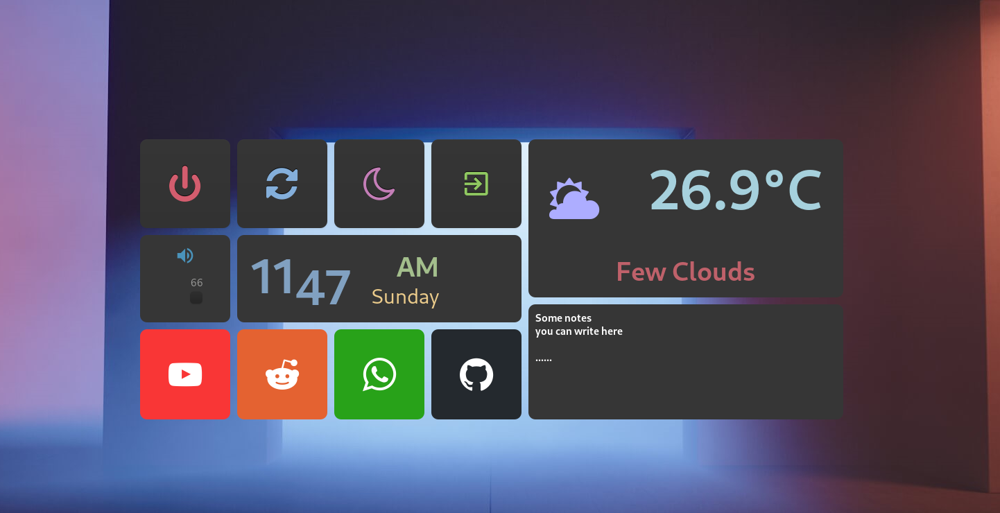

# A guide to my personal setup

This guide contains everything I do to completely setup my distro.

# Dashboard



# Installation

## Install Arch Linux

Download the Arch Linux ISO from the official website.
Burn the ISO file to a USB medium.

```bash
sudo dd bs=4M if=/path/to/iso of=/dev/usb conv=fdatasync
```

Live CD into the USB and run `archinstall` (or, do it the [hard way](https://wiki.archlinux.org/title/Installation_guide)).

Proceed with the installation.
No desktop environment is needed.

## Wi-Fi

If you need to connect to a Wi-Fi network you can use `iwctl`.

```bash
systemctl enable iwd
systemctl start iwd
iwctl
<connect>
```

## Git

### Basic configuration

```bash
sudo pacman -S git
git config --global user.name <user>
git config --global user.email <email>
```

### GPG Keys

```bash
# Create the key pair
gpg2 --expert --full-gen-key

# or import them
gpg2 --import public.gpg
gpg2 --import private.gpg
```

Get the uid of the key using:

```bash
gpg2 --list-secret-keys
```

If you created the key pair, export the public key:

```bash
gpg2 --export --armor --output public.gpg <KEY>
```

Import the key to your profile at:

https://github.com/settings/keys

and set up git:

```bash
rm public.gpg
git config --global --unset gpg.program
git config --global --add gpg.program /usr/bin/gpg2
git config --global user.signingkey <KEY>
git config --global commit.gpgsign true
```

## Rust

```bash
sudo pacman -S cargo rustup
rustup default stable
```

## Installing Paru (AUR helper)

```bash
sudo pacman -S --needed base-devel
git clone https://aur.archlinux.org/paru.git
cd paru
makepkg -si
cd ..
rm -r paru
```

## Chaotic-AUR

Follow the instructions at:

https://aur.chaotic.cx/

## Download the dotfiles

```bash
git clone https://github.com/paolobettelini/dotfiles
```

## Common packages

```bash
sudo pacman -S \
    pipewire \
    wireplumber \
    piper \
    nautilus \
    gwenview \
    alacritty \
    eza \
    swayimg \
    celluloid \
    dunst \
    cmatrix \
    nmap \
    dysk \
    ripgrep \
    ntfs-3g \
    alsa-utils \
    jq \
    grim \
    slurp \
    awww \
    zbar \
    unzip \
    gimp \
    nano \
    wget \
    obs-studio \
    xournalpp \
    rnote

paru -S \
    firefox-nightly \
    wlrobs-hg \
    gotop \
    pacseek
```

## xdg-desktop-portal

```bash
sudo pacman -S \
    xdg-desktop-portal \
    xdg-desktop-portal-gtk \
    xdg-desktop-portal-hyprland
```

## Discord

```bash
paru -S discord-canary
```

## Scripts

```bash
cd dotfiles
sudo chmod +x scripts/*
sudo cp scripts/* /usr/local/bin
cd ..
```

## Hyprland

```bash
sudo pacman -S hyprland
```

Copy the configuration:

```bash
cd dotfiles
mkdir -p ~/.config/hypr
cp -r hyprland/* ~/.config/hypr/
cd ..
```

The main configuration file is:

```text
~/.config/hypr/hyprland.lua
```

### split-monitor-workspaces

```bash
mkdir -p ~/.config/hypr/plugins
cd ~/.config/hypr/plugins

git clone https://github.com/zjeffer/split-monitor-workspaces
cd split-monitor-workspaces

git checkout release/0.56.x

cd ~
```

Make sure the selected branch matches the installed Hyprland version.

Reload the configuration:

```bash
hyprctl reload
hyprctl configerrors
```

## Rtfetch

```bash
git clone https://github.com/paolobettelini/rtfetch
cd rtfetch
rustup default nightly
cargo build --release
sudo mv target/release/rtfetch /usr/local/bin
cd ..
```

## Fish (shell)

```bash
sudo pacman -S fish starship

cd dotfiles

mkdir -p ~/.config/starship
mkdir -p ~/.config/fish

fish
exit

cat fish/config.fish >> ~/.config/fish/config.fish
cp starship/starship.toml ~/.config/starship/

cd ..
```

Set fish as the default shell:

```bash
chsh -s /bin/fish
```

## Application launcher

```bash
paru -S rofi-lbonn-wayland-git

mkdir -p ~/.config/rofi

cd dotfiles
cp rofi/config.rasi ~/.config/rofi/
cd ..
```

To start it run:

```bash
rofi -show drun
```

## Wallpapers

Create a folder for the wallpapers:

```bash
sudo mkdir -p /usr/share/backgrounds

cd dotfiles
sudo cp wallpapers/* /usr/share/backgrounds/
cd ..
```

To set the background:

```bash
awww img /path/to/wallpaper
```

## Neovim

```bash
sudo pacman -S neovim npm lldb

git clone https://github.com/NvChad/NvChad ~/.config/nvim --depth 1

nvim

cd dotfiles
cp -r nvim/custom ~/.config/nvim/lua
cd ..

nvim
```

## Screen recording

```bash
sudo pacman -S wf-recorder
```

## SDDM

```bash
sudo pacman -S \
    sddm \
    libqt5xdg \
    qt5-quickcontrols2 \
    qt5-graphicaleffects \
    qt5-svg

sudo systemctl enable sddm
```

Copy the configuration:

```bash
sudo mkdir -p /etc/sddm.conf.d

cd dotfiles
sudo cp sddm/sddm.conf /etc/sddm.conf.d/
cd ..
```

Download the theme from:

https://www.opendesktop.org/p/1312658

Install it:

```bash
sudo mkdir -p /usr/share/sddm/themes
sudo rm -rf /usr/share/sddm/themes/*

sudo tar -xzvf \
    ~/Downloads/sugar-candy.tar.gz \
    -C /usr/share/sddm/themes

cd dotfiles

sudo cp \
    sddm/theme.conf.user \
    /usr/share/sddm/themes/sugar-candy

cd ..
```

## Clipboard manager

```bash
sudo pacman -S cliphist
```

## Theming

### Icons

```bash
sudo pacman -S \
    hicolor-icon-theme \
    adwaita-icon-theme
```

Download Candy Icons from:

https://github.com/EliverLara/candy-icons/archive/refs/heads/master.zip

```bash
unzip candy-icons-master.zip
sudo mv candy-icons-master /usr/share/icons/candy-icons
```

TODO Sweet folders:

https://github.com/EliverLara/Sweet-folders

### Fonts

Download the fonts from:

https://www.nerdfonts.com/font-downloads

* FantasqueSansMono Nerd Font
* DejaVuSansMono Nerd Font

```bash
sudo mkdir -p /usr/local/share/fonts

sudo unzip -a \
    ~/Downloads/DejaVuSansMono.zip \
    -d /usr/local/share/fonts/

sudo unzip -a \
    ~/Downloads/FantasqueSansMono.zip \
    -d /usr/local/share/fonts/

sudo rm /usr/local/share/fonts/*.txt
sudo rm /usr/local/share/fonts/*.md

sudo fc-cache -fv
```

TODO NotoColorEmoji.ttf

### QT Theme

```bash
sudo pacman -S qt5ct qt6ct
```

### GTK Theme

Download the source code from:

https://github.com/EliverLara/Sweet/tree/nova

Branch: `nova`

```bash
unzip Sweet-nova.zip
sudo mv Sweet-nova /usr/share/themes/Sweet-Nova
sudo chown -R root:root /usr/share/themes/Sweet-Nova
```

### Apply theming

```bash
sudo pacman -S nwg-look

nwg-look
qt5ct
qt6ct
```

The GTK and QT environment variables are configured in:

```text
~/.config/hypr/hyprland.lua
```

## Widgets

```bash
cd dotfiles/widgets/dashboard

sudo pacman -S gtk4 gtk-layer-shell gtk4-layer-shell

cargo build --release

sudo mv target/release/dashboard /usr/local/bin/

cd ../..
```

Set the weather configuration in `hyprland/hyprland.lua`:

```lua
hl.env("WEATHER_API_KEY", "<key>>")
hl.env("WEATHER_LOCATION", "London,uk")
hl.env("WEATHER_UNITS", "metric")
```

TODO install qt5-wayland or qt6-wayland.

## MPD

```bash
sudo pacman -S mpc mpd

mkdir -p ~/.config/mpd
mkdir -p ~/.mpd

cd dotfiles
cp mpd/mpd.conf ~/.config/mpd/mpd.conf
cd ..

systemctl --user enable mpd.service
```

TODO

## LaTeX

```bash
sudo pacman -S tectonic
```

# Latex-Rec

```bash
git clone https://github.com/paolobettelini/tauri-myscript-latex
cd tauri-myscript-latex

cargo tauri build

sudo mv \
    src-tauri/target/release/bundle/appimage/latex-rec_<v>.AppImage \
    /usr/local/bin/latex-rec

cd ..
```
